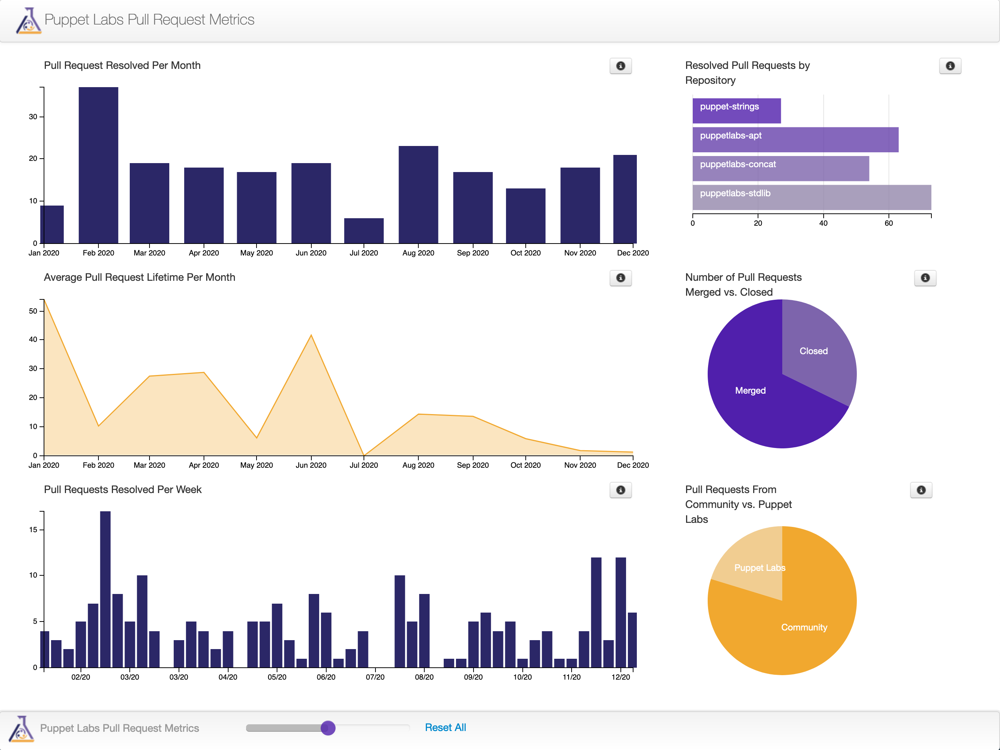
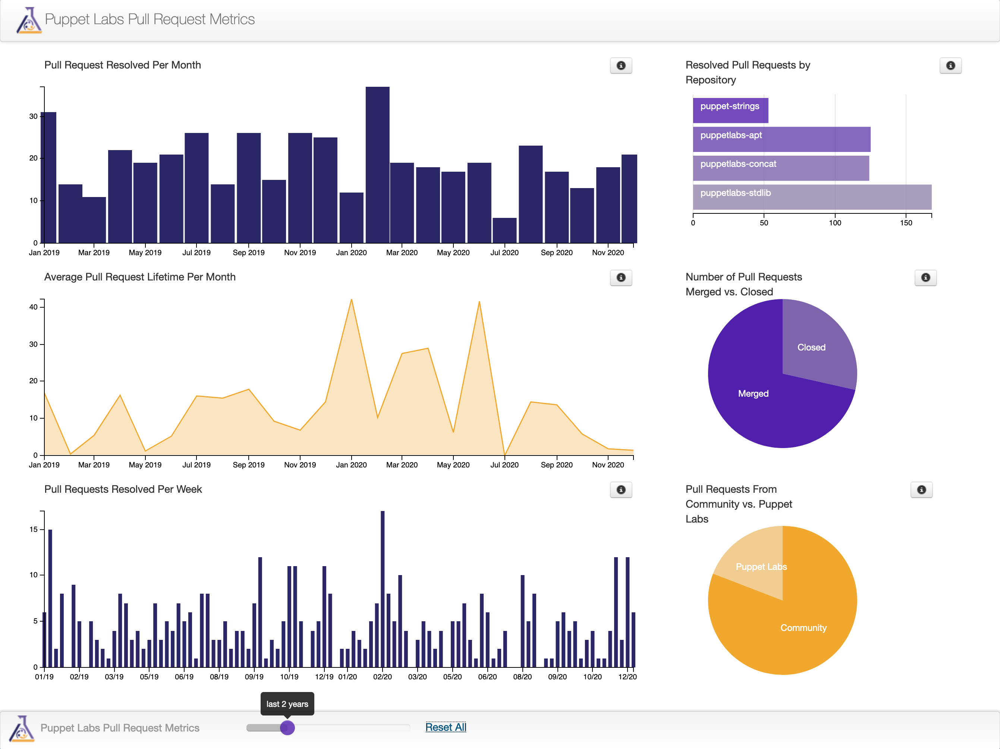
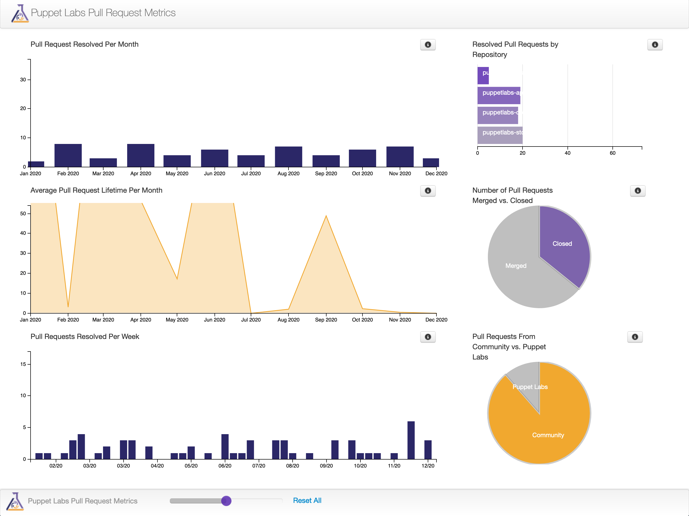
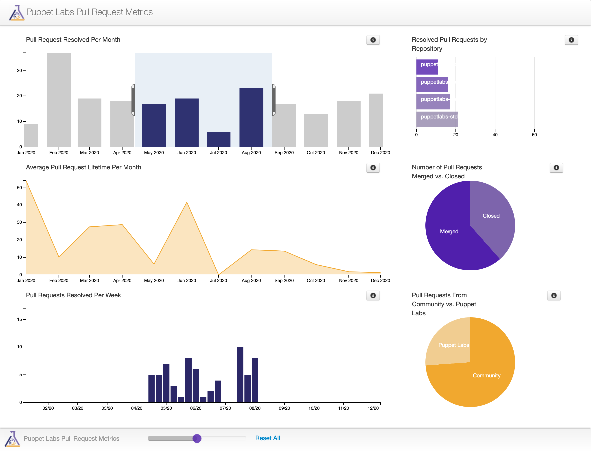

### A live demo of this application can be viewed [here](https://community-data-demo.herokuapp.com/)!
## Hello from December 2020

This is a fork of the original project [puppetlabs/puppet_community_data](https://github.com/puppetlabs/puppet_community_data) which was developed by Hailee Kenney (that's me) when they were an intern and open sorce developer at Puppet Labs (now Puppet). Since they wanted to be able to use this project for some portfolios, they have made their own version that they can develop on to make the appropriate updates to get things rolling again for screenshots and maybe live demos.

Here are a few screenshots of what the live application looks like:

<em>The application in its default state</em>

 

<em>The slider at the bottom of the application changes the time frame of the data being displayed</em>

 

<em>The graphs are highly interactive and changing the view of one will impact the range of data displayed on the others</em>

 

The original project README follows:

# PuppetCommunityData

The goal of this project is to create a dashboard to monitor how Puppet Labs is doing responding to pull requests and the general state of the open source repositories.

The application is currently being hosted in Heroku and is viewable [here](http://pullrequestmetrics.herokuapp.com/).

## Usage

As mentioned, this application is hosted in [Heroku](https://devcenter.heroku.com/articles/ruby) and the data is stored in a [Heroku PostgreSQL](https://postgres.heroku.com/) database. Therefore, you will  need your own Heroku login in order to host the application. 

This project uses Bundler as it is required for Heroku. To install the needed gems simply do:

    $ bundle install

To populate the database with new information, run:

    $ heroku run bundle exec rake job:import

Since the application is using the GitHub API, it's important to set your authorization token, otherwise GitHub will
greatly limit how much data you can get at a time. The `application.rb` class is responsible for creating the GitHub client. It will look for your authorization token to be
stored as an environment variable called `PCD_GITHUB_OAUTH_TOKEN`.

For the automated database updating to work, you must also set this variable in Heroku by doing:

    $ heroku config:set PCD_GITHUB_OAUTH_TOKEN=12345

If you wish to change the repositories which will be queried you can do so in the Rakefile by changing which repositories are passed into `generate_repositories` by changing the `repo_names` variable. The variable is an array of strings where each string is a full repository name (i.e. name/owner). Be sure to update the variable in both the `import` and `import_if_sunday` jobs.

If the Heroku application is properly configured using the Heroku Scheduler add-on, a Rake task will run daily to update the database. Due to the desire not to use excess [dyno](https://devcenter.heroku.com/articles/dynos) time, the actual database update will only occur if it's a Sunday.

If you want to run the scheulded Rake task right away, you can do:

    $ heroku run bundle exec rake job:import_if_sunday
    
## Development 

Since this project uses Ruby, it has a few gem dependencies. You must use Bundler if you want to deploy this app to Heroku, so I highly recommend you also use it for your local development environment. The gem dependancies are listed in the `Gemfile` and all you need to do to get them is do a bundle install: 

    $ bundle install

This also means that when running things that rely on Ruby gems, you must put a `bundle exec` in front of the command. For example, if you want to run the tests you must do:

    $ bundle exec rspec spec

The project currently has decent test coverage for the database and data collection related operations, but lacks testing for the front end web pieces. If you make changes that break the tests, please update them. Additionally, most of the methods have yardoc method headers, so if you add a new one please add documentation.

For specific details on what you'll need to be familiar with (aside from things like Ruby, Rspec, HTML, etc), see the 'Tools' section.

## Tools

This project uses a lot of different languages, tools, and libraries. If you're going to develop on this project, it's probably a good idea to be somewhat familiar with the following:

* [Active Record](http://api.rubyonrails.org/classes/ActiveRecord/Base.html)
* [PostreSQL](http://www.postgresql.org/)
* [Bundler](http://bundler.io/)
* [Heroku](https://devcenter.heroku.com/articles/ruby)
    * [Heroku PostgreSQL](https://devcenter.heroku.com/categories/heroku-postgres)
    * [Heroku Scheduler](https://devcenter.heroku.com/articles/scheduler)
* [dc.js](http://nickqizhu.github.io/dc.js/)
    * [crossfilter.js](https://github.com/square/crossfilter/wiki) (dc.js dependency)
    * [d3.js](https://github.com/mbostock/d3/wiki) (dc.js dependency)
* [Sinatra](http://www.sinatrarb.com/)
* [Bootstrap](http://getbootstrap.com/)
    * [jQuery](http://jquery.com/) (Bootstrap dependency)
